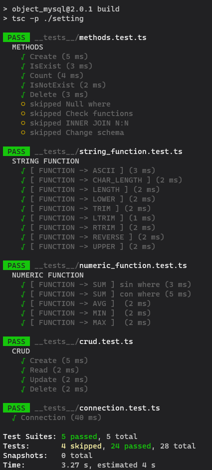

<table border="0" collapse="0">
 <tr>
    <td></td>
    <td> 
    <h1>Module: object_mysql</h1>
    <h2>Retrieve databases in Javascript object format</h2>
    <p>With this module synchronize the Mysql database in a more dynamic<br> way to implement in your project created with NodeJs</p>
    <button name="button" style="background:#2196f3; color:white; border:none; padding:10px 20px; border-radius:10px; cursor:pointer;" onclick="https://www.npmjs.com/package/object_mysql">Ir a npm</button>
    </td>
 </tr>
</table>
# Module: object_mysql
## Retrieve databases in Javascript object format

With this module synchronize the Mysql database in a more dynamic way to implement in your project created with NodeJs</p

### Installation

```sh
npm i object_mysql
```

## Last test

Tests have been carried out to check the operation of the connections, create, read, update, remote and also additional functions

